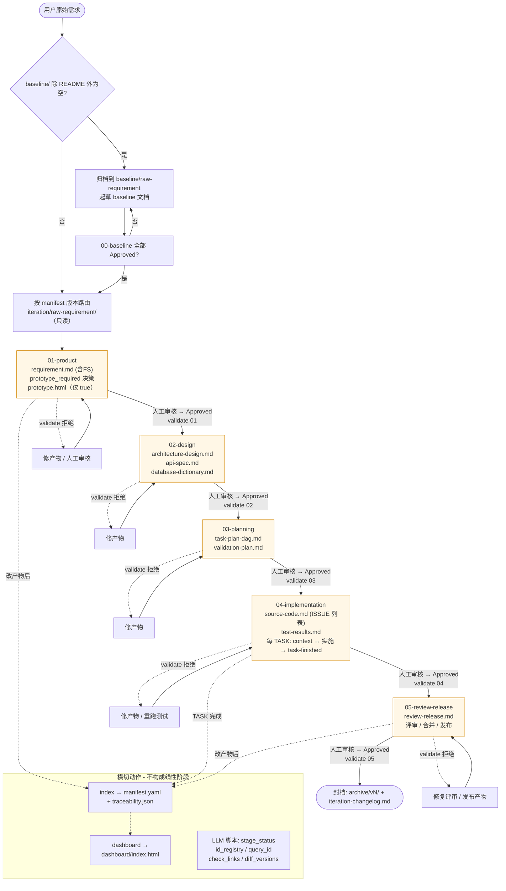

# Alchemy Works (AW) — 软件开发工作流

> AlchemyWorks/ AW软件工厂：以**双段版本号**为顶层单元的阶段化交付流水线。
> 支持 0→1 项目搭建 + 后续需求迭代；每个版本的所有阶段产物自动与 `v{major}.{minor}` 关联。

---

## 1. 项目结构

```
├── baseline/                        # 项目级常量（章程、愿景、术语、技术选型、ADR）
│   ├── 01-product-vision.md
│   ├── 02-product-charter.md
│   ├── 03-tech-stack-decision.md
│   ├── 04-glossary.md
│   ├── decisions/                   # 重大架构决策记录
│   └── raw-requirement/             # baseline 为空时归档用户原始需求
│       └── README.md                 # 原始需求输入说明
├── iteration/                       # 版本化产物（每个迭代一个目录）
│   ├── README.md                     # 版本目录使用说明
│   ├── raw-requirement/              # 用户原始需求集中库（只读）
│   └── v{major}.{minor}/            # 双段号；
│       ├── 01-product/
│       ├── 02-design/
│       ├── 03-planning/
│       ├── 04-implementation/
│       └── 05-review-release/
├── templates/                       # 跨版本复用的文档与代码模板（已合并为 3 个）
├── workspace/                       # 真实代码仓库（Git；后端 + 前端）
│   └── README.md                     # 源码工作区说明
├── .agents/skills/                  # 阶段化 AI Agent Skill（6 个）
└── .workflow/                       # 工作流 CLI + 状态 + 缓存
    ├── workflow.py                  # 主 CLI（纯 stdlib）
    ├── workflow-file-inventory.md   # 工作流必要文件与目录权威清单
    ├── manifest.yaml                # 产物索引（自动）
    ├── traceability.json            # 稳定 ID 追溯图（自动）
    ├── cache/                       # context-pack 缓存
    ├── context-packs/               # TASK-scoped 上下文包
    ├── task-runs/                   # TASK 结论 JSON
    ├── dashboard/                   # 静态 HTML 仪表盘
    └── scripts/                     # 5 个 LLM 自动化脚本
```

---

## 2. 版本号规范

格式：`v{major}.{minor}`（双段号）。

| 规则 | 含义 |
|---|---|
| **首版** | `v1.0`（与首次 `iteration/` 目录同号）|
| **小迭代** | `v{major}.{minor+1}`（每次迭代**严格 +1**，不允许跳号如 `v1.2` → `v1.4`）|
| **重大变更** | `v{major+1}.0`（架构重置、新项目、技术栈变更）|
| **目录命名** | `iteration/v{major}.{minor}/` |
| **文件前缀** | `v{major}.{minor}-*.md` / `.html` |
| **归档** | RC 完成后旧版整体迁移至 `iteration/archive/v{major}.{minor}/` |

详细规则见 `AGENTS.md §17 Versioning and Archive Rules`。

初始化命令：

```powershell
python .workflow/workflow.py init          # 创建项目级目录，不创建版本
python .workflow/workflow.py init-version  # baseline 门禁通过后创建下一个版本
```

---

## 3. 阶段流水线（原始需求输入 + 5 个交付阶段）

```text
用户提供的原始需求（格式不限）
        ↓ route-requirement + normalize-requirement
baseline/ 为空 → baseline/raw-requirement/ → 起草 baseline → validate 00-baseline
baseline/ 已初始化 → iteration/raw-requirement/（route-requirement 返回目标版本）→ 起草 01-product
baseline/
        05-core-user-flow-prototype.html            # 必需：核心用户旅程交互基线
iteration/v{major}.{minor}/01-product/
        v{major}.{minor}-requirement.md            # 需求 + 功能规格（合并）
        v{major}.{minor}-prototype.html            # 仅 `prototype_required: true` 时的可交互 UI 原型
        v{major}.{minor}-iteration-changelog.md     # 仅 RC 后产出（封档说明）
        ↓ validate 01-product
iteration/v{major}.{minor}/02-design/
        v{major}.{minor}-architecture-design.md
        v{major}.{minor}-api-spec.md
        v{major}.{minor}-database-dictionary.md
        ↓ validate 02-design
iteration/v{major}.{minor}/03-planning/
        v{major}.{minor}-task-plan-dag.md
        v{major}.{minor}-validation-plan.md
        ↓ validate 03-planning
iteration/v{major}.{minor}/04-implementation/
        v{major}.{minor}-source-code.md             # 实施主记录（含 ISSUE 列表）
        v{major}.{minor}-test-results.md
        ↓ validate 04-implementation
iteration/v{major}.{minor}/05-review-release/
        v{major}.{minor}-review-release.md           # 评审、合并、发布决定与 release notes
        ↓ validate 05-review-release
        ↓
iteration/archive/v{major}.{minor}/    ← 旧版整体快照（只读）
```

**关键约定**：

- 每份正式阶段产物需有 `status: Approved` frontmatter 才算"通过"（否则 gate 拒绝）；原始需求是来源材料，不要求统一格式或审批状态。`iteration/raw-requirement/` 除 README 外仅保存用户原文件，Agent 只读，不得修改、重命名或删除；`route-requirement` 输出其对应版本。
- `Approved` 状态下若含占位词（`TODO` / `TBD` / `XXX` / `[待确认]` / `[未提供]` / `占位`），validate 视为 unresolved blocker
- 上游产物必须 Approved 才能作为下游阶段的正式输入
- Agent 只能创建或更新 `status: draft` / `status: In Review` 的产物，**不得**写入或修改 `status: Approved`。每个阶段完成时，Agent 必须列出待人工审核的全部必需产物及验证证据；人类手动审核并将各产物改为 `Approved` 后，才可运行该阶段的 `validate` 并开始下一阶段。

每阶段的交接闭环：`Agent 起草产物 → Agent 列出待审产物与验证证据 → 人类手动设为 Approved → validate --stage <当前阶段> 通过 → 开始下一阶段`。

---

## 4. AI Agent Skill 体系（6 个）

| Skill | 触发场景 | 输出 |
|---|---|---|
| `stage-gate` | 开始、交接或审核任一阶段 | 校验完整上游链、人工审核状态与阶段输入 |
| `normalize-requirement` | 任何新需求文档产出 | `v{major}.{minor}-requirement.md` + change_set |
| `prototype-design-system` | 01 阶段 UI 原型设计 | 视觉与组件规范参考 |
| `iterate-implementation` | 04 阶段 TASK 实施 | 源码 + 测试 + ISSUE |
| `manage-iteration` | 创建 / 归档版本 | `iteration/v{N}/` + `archive/v{N}/` |
| `workflow-governance` | 任意阶段 | 门禁 + 索引 + 追溯 + Context Pack |

所有 Skill 位于 `.agents/skills/<name>/SKILL.md`，触发条件命中时自动加载。

### 原型生成工具路由

进入 `01-product` 生成或修改 HTML 原型前，先执行原型预览工具检查：

- 仅当 baseline 核心流程原型或某版本 `prototype_required: true` 时：Codex 必须使用 `visualize` 插件进行交互预览或关键交互检查，再生成项目内的 HTML 原型。预览插件不可用时暂停并引导用户安装/启用。
- 其他 Agent：在需要生成原型时，先搜索功能等价的交互可视化或原型预览插件，记录替代工具后再生成；找不到替代工具时暂停并请求用户处理。
- 工具预览是原型生成的前置验证，不替代正式阶段产物；阶段记录必须写明实际使用的工具、检查结果和阻断原因（如有）。

---

## 5. 模板体系（3 个跨版本模板）

位于 `templates/`：

| 模板 | 文件 | 用途 | 派生产物 |
|---|---|---|---|
| **product** | `product.md` | 需求 + 功能规格（合并）| `v{N}-requirement.md`（FS 段落作为 FR 子项内嵌） |
| **design** | `design.md` | 架构 + API + DB（合并）| `v{N}-architecture-design.md` + `api-spec.md` + `database-dictionary.md` |
| **implementation** | `implementation.md` | 任务 DAG + 验证 + 源码 + 测试 + ISSUE（合并）| `v{N}-task-plan-dag.md` + `validation-plan.md` + `source-code.md` + `test-results.md` |

辅助文件：`Prototype.html`（UI 原型基线）+ `prototype-design-system.md`（视觉规范）+ `design-tokens.json`（设计令牌）。

模板**不带版本号**；生成实际产物时把 `v{major}.{minor}` 占位符替换为具体值。

---

## 6. 工作流 CLI（`.workflow/workflow.py`，纯 Python 标准库）

> §3 是阶段产物清单，本节是**端到端流程图**——把 baseline gate、5 个 stage gate、横切的 index/dashboard/ID 注册，以及"未通过 → 修产物"的回路一次性画出来。



```bash
# 索引与门禁
python .workflow/workflow.py index      --iteration v1.0       # 生成 manifest + traceability + 缓存
python .workflow/workflow.py state      --iteration v1.0 --refresh # 刷新并显示恢复工作所需的最小状态
python .workflow/workflow.py refresh    --iteration v1.0 --stage 02-design # 文档变更后：索引、刷新状态并运行门禁
python .workflow/workflow.py resume     --json                   # 新会话首选：只输出最小恢复状态
python .workflow/workflow.py preflight  --iteration v1.0 --json  # 本地门禁、DAG、覆盖率检查
python .workflow/workflow.py validate   --iteration v1.0       # 校验全部 stage
python .workflow/workflow.py validate   --iteration v1.0 --stage 02-design   # 单 stage 校验

# 任务管理
python .workflow/workflow.py context    --iteration v1.0 --task TASK-API-010   # 生成/复用 TASK Context Pack
python .workflow/workflow.py context    --iteration v1.0 --task TASK-API-010 --compact --max-chars 12000
python .workflow/workflow.py task-finished --iteration v1.0 --task TASK-API-010 --result succeeded
# ↑ 默认仅追加 task-runs JSON，不触发 index/dashboard
#   --refresh-index      当任务改变了产物状态时加上
#   --refresh-dashboard  当要立即刷新仪表盘时加上

# 仪表盘
python .workflow/workflow.py dashboard  --iteration v1.0       # 渲染静态 HTML 仪表盘
```

**子命令表**：

| 子命令 | 功能 | 写入文件 |
|---|---|---|
| `index` | 全产物索引 + traceability 图 + 恢复检查点 | `manifest.yaml` / `traceability.json` / `current-state.json` |
| `state` | 刷新或读取当前阶段、阻塞项、下一动作和 Context Pack | `current-state.json` |
| `refresh` | 文档变更后依次执行 `index`、`state --refresh` 和 `validate`；首个失败即停止 | 同 `index` / `state`，并输出门禁结果 |
| `resume` | 输出新会话所需的最小恢复 JSON | stdout |
| `preflight` | 本地执行门禁、TASK DAG 和 AC/TASK 覆盖率检查 | stdout / JSON |
| `review-pack` | 生成人工审核证据摘要，不修改审批状态 | stdout / JSON |
| `validate` | stage gate 检查（无产物修改）| stdout + exit code |
| `context` | 提取 TASK 相关章节，去重、限长并按 hash 复用 | `context-packs/<ver>-<task>.md` |
| `task-finished` | 写入最新 TASK 结论并保留历史记录 | `task-runs/<ver>-<task>.json` + `task-runs/history/*.json` |
| `dashboard` | 渲染静态 HTML 仪表盘 | `dashboard/index.html` |

所有命令子命令接受 `--iteration`（默认从 `iteration/` 推断最大值；不存在则返回 `v1.0`）。

工作流生成的 `generated_at`、`checked_at`、`recorded_at` 和 Context Pack 时间均使用执行 Codex 客户端的本地时区，并保留 ISO 8601 偏移量。

---

## 7. LLM 自动化脚本（`.workflow/scripts/`）

5 个本地脚本，让 LLM 不必亲自 grep / read 多份文档：

| 脚本 | 命令示例 | 替代的 LLM 行为 |
|---|---|---|
| `stage_status.py` | `--iteration v1.0` | "v1.0 现在到哪个阶段？能进下一阶段吗？" |
| `id_registry.py` | `--iteration v1.0 --prefix FR` | "下一个可用 FR 是多少？" |
| `query_id.py` | `--id FR-005 --iteration v1.0` | "FR-005 出现在哪些文件？" |
| `check_links.py` | `--iteration v1.0` | "v1.0 文档里有断链吗？" |
| `diff_versions.py` | `--from v1.0 --to v1.1` | "v1.0 → v1.1 改了哪些 ID？哪些 deprecated？" |

所有脚本纯 stdlib，可独立运行：

```bash
python .workflow/scripts/stage_status.py --iteration v1.0
python .workflow/scripts/id_registry.py --iteration v1.0
python .workflow/scripts/query_id.py --id TASK-API-010 --iteration v1.0
python .workflow/scripts/check_links.py --iteration v1.0
```

---

## 8. 稳定 ID 与追溯

通过 9 类前缀保证跨版本稳定：

| 前缀 | 含义 | 例 |
|---|---|---|
| `FR-NNN` | 功能需求 | `FR-001` |
| `BR-NNN` | 业务规则 | `BR-005` |
| `NFR-NNN` | 非功能需求 | `NFR-030` |
| `FS-NNN` | 功能规格（v1.0+ 并入 requirement 作为 FR 子项；不再独立成文）| `FS-001` |
| `API-NNN-NNN` | API 端点 | `API-PROJ-001` |
| `TBL-NNN-NNN` | 数据表 | `TBL-USER-001` |
| `TASK-NNN-NNN` | 实施任务 | `TASK-API-010` |
| `AC-NNN` | 验收标准 | `AC-007` |
| `ISSUE-NNN` | Issue 记录 | `ISSUE-014` |

追溯自动从 markdown 中提取并存入 `.workflow/traceability.json`（`index` 子命令产出）。

---

## 9. 常用工作流

### 9.1 启动一个新版本（v1.0）

```
1. 用户提供原始需求；`route-requirement` 发现 baseline 为空并返回 `baseline/raw-requirement/`
2. 归档原始材料，触发 normalize-requirement 起草 4 份 baseline 文档和核心流程原型
3. 人工审核 baseline → `validate --stage 00-baseline`
4. 创建 `iteration/v1.0/` 骨架；`route-requirement` 返回该原始需求的目标版本，原文件保留在 `iteration/raw-requirement/`
5. 触发 normalize-requirement → 生成 v1.0-requirement.md
6. 人工审核 → status: Approved
7. 进入 02-design / 03-planning / 04-implementation / 05-review-release
8. RC 完成 → 生成 v1.0-iteration-changelog.md，并归档 v1.0
```

### 9.2 启动 v1.1+ 增量迭代

```
1. 用户提供原始需求；`route-requirement` 从 manifest.yaml（缺失时目录发现）解析目标版本
2. 创建目标版本骨架；将原始材料原样保存到 `iteration/raw-requirement/`，并以 `route-requirement` 返回的目标版本归一化
3. 触发 normalize-requirement → 读项目基线、原始需求、上一版 requirement 与 changelog
4. 输出对应版本 requirement.md（含 change_set: added / modified / deprecated）
5. 人工审核 → status: Approved
6. 触发 iterate-implementation skill（按 TASK 列表实施）
7. 每个 TASK 完成 → python .workflow/workflow.py task-finished --result succeeded
8. RC 完成 → manage-iteration 归档上一版本
```

### 9.3 实施单个 TASK

```bash
# 1. 启动前：本地生成最小恢复状态
python .workflow/workflow.py resume --json

# 2. 启动任务前：本地 preflight + 校验 gate + 生成紧凑 Context Pack
python .workflow/workflow.py index    --iteration v1.0
python .workflow/workflow.py preflight --iteration v1.0 --json
python .workflow/workflow.py validate --iteration v1.0 --stage 04-implementation
python .workflow/workflow.py context  --iteration v1.0 --task TASK-API-010 --compact --max-chars 12000

# 2. 读 .workflow/context-packs/v1.0-TASK-API-010.md（任务片段，非整篇）

# 3. 实际写代码到 workspace/

# 4. 完成：轻量记录（默认）
#    task-finished 要求 Context Pack 已存在，否则拒绝写入完成记录
python .workflow/workflow.py task-finished --iteration v1.0 --task TASK-API-010 --result succeeded --auto-refresh
# ↑ 不重跑 index/dashboard；高频操作零开销
# ↓ 偶尔才需要：
python .workflow/workflow.py task-finished ... --refresh-dashboard

# 5. 查看阶段进度
python .workflow/scripts/stage_status.py --iteration v1.0
```

### 9.4 跨版本引用查询

```bash
# "FR-005 出现在 v1.0 的哪里？"
python .workflow/scripts/query_id.py --id FR-005 --iteration v1.0
# 输出：FR-005 — found in 2 artifact(s)
#   - iteration/v1.0/01-product/v1.0-requirement.md  (FS 作为 FR 子项内嵌)
```

### 9.5 跨版本 ID diff

```bash
# "v1.0 → v1.1 改了哪些 ID？哪些 FR 被废弃了？"
python .workflow/scripts/diff_versions.py --from v1.0 --to v1.1
# 输出：4 个 bucket: added / modified / removed / deprecated
# - 当有 deprecated ID 时脚本返回 exit 2（便于 CI gate 拦截）
# - --json 输出完整结构（含每个 modified ID 的 added_in / removed_from）
```

---

## 10. 阶段产物精简（当前状态）

| 阶段 | 产物 |
|---|---|
| 01-product | `requirement.md`（FS-XXX 作为 FR-XXX 子项内嵌，含 `prototype_required` 决策）；`prototype.html` 仅在该决策为 `true` 时必需 |
| 02-design | `architecture-design.md`、`api-spec.md`、`database-dictionary.md` |
| 03-planning | `task-plan-dag.md`、`validation-plan.md` |
| 04-implementation | `source-code.md`（含 ISSUE 列表）、`test-results.md` |
| 05-review-release | `review-release.md`（评审、合并、发布决定、release notes） |

---

## 11. 验证检查清单

```bash
# 1. 验证当前迭代
python .workflow/workflow.py validate --iteration v1.0

# 2. 看阶段进度
python .workflow/scripts/stage_status.py --iteration v1.0

# 3. 跑单测
python -m unittest discover -s .workflow/tests -p test_workflow.py

# 4. 检查断链
python .workflow/scripts/check_links.py --iteration v1.0
```

期望输出：
- `validate` → `result: PASS (0 errors, 0 warnings)`
- `stage_status` → 所有 ✅ `approved` + `Overall gate: passed`
- `unittest` → `Ran 5 tests in ... OK`
- `check_links` → `✅ all local links resolve` 或仅 warning

---

## 12. AGENTS.md 角色

`AGENTS.md` 是项目级 AI Agent 与开发者协作规则（含 §17 版本化规则、source-of-truth 优先级、TDD 标准、commit 约定等）。它是**唯一**对所有 Skill / Agent 生效的全局规则文件。详见 `AGENTS.md`。

---

## 13. License

MIT

---

## 14. ⚠️ 免责声明 / Disclaimer

> 本项目当前处于 **实验阶段**，仅供 AI 工作流自动化的学习与研究使用。
>
> **不建议、亦不应用于任何生产环境。** 项目中涉及的脚本、模板、生成的代码与文档，均按"现状"提供，不附带任何形式的明示或暗示保证。
>
> 本项目（或其衍生作品）的使用、复制、修改、分发等行为所**直接、间接、附带或偶然产生**的任何损失（包括但不限于数据丢失、业务中断、服务不可用、经济损失、知识产权纠纷等），**作者与贡献者均不承担任何责任**。
>
> 使用者需自行评估其适用性，并对其使用本项目所产生的全部后果承担完全责任。
